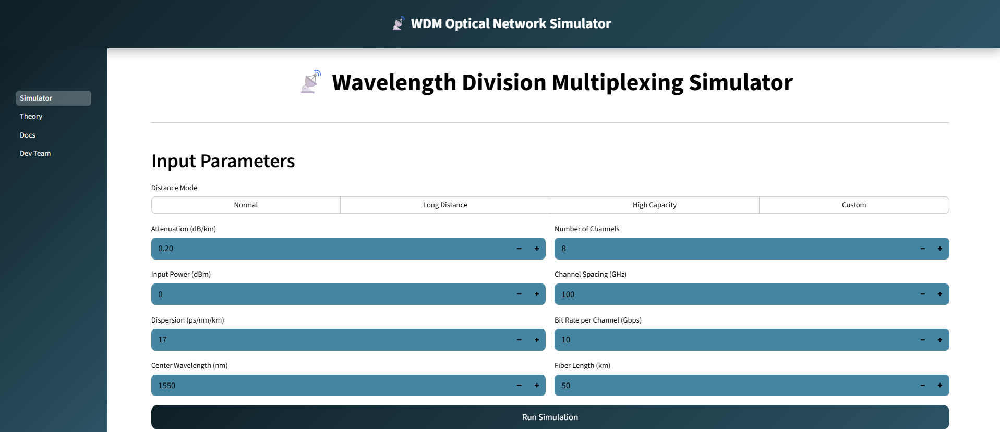
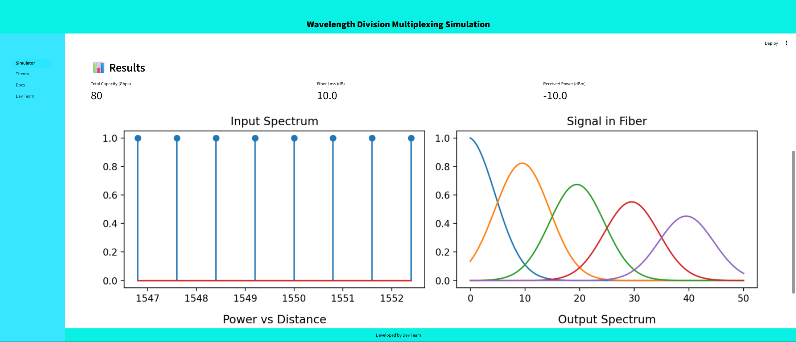

# Wavelength Division Multiplexing (WDM) Simulation

An interactive **web-based WDM simulator** built using Streamlit that helps visualize and analyze optical fiber communication systems.

---

## Project Overview

This project simulates **Wavelength Division Multiplexing (WDM)** systems, allowing users to:

* Configure optical communication parameters
* Analyze transmission performance
* Visualize signal behavior through graphs

It provides both **educational insight** and **practical experimentation**.





---

## Getting Started

### 1️⃣ Create Virtual Environment (Recommended)

```bash
python -m venv venv
```

Activate environment:

* **Windows**

```bash
venv\Scripts\activate
```

* **Linux / Mac**

```bash
source venv/bin/activate
```

---

### 2️⃣ Install Dependencies

```bash
pip install -r requirements.txt
```

---

### 3️⃣ Run the Application

```bash
streamlit run Simulator.py
```

Open in browser:
[http://localhost:8501](http://localhost:8501)

---

## Usage Guide

### Workflow

1. **Select Distance Mode**

   * **Normal** → Standard configuration
   * **Long Distance** → High loss scenario
   * **High Capacity** → Dense channel system
   * **Custom** → Full manual control

2. **Configure Parameters**

| Left Column            | Right Column          |
| ---------------------- | --------------------- |
| Attenuation (dB/km)    | Number of Channels    |
| Input Power (dBm)      | Channel Spacing (GHz) |
| Dispersion (ps/nm/km)  | Bit Rate (Gbps)       |
| Center Wavelength (nm) | Fiber Length (km)     |

3. **Run Simulation**

   * Click **"Run Simulation"**

4. **Analyze Results**

   * View metrics + graphs

---

## Output Visualizations

The simulator generates **4 key plots**:

* **Input Spectrum** → Channel wavelengths at input
* **Signal in Fiber** → Signal propagation behavior
* **Power vs Distance** → Attenuation curve
* **Output Spectrum** → Final signal condition

---

## 📁 Project Structure

```
WDM_Simulation/
│
├── Simulator.py              # Main Streamlit app
├── requirements.txt          # Dependencies
├── README.md                 # Documentation
├── LICENSE                   # MIT License
│
├── pages/
│   ├── 2_Theory.py           # WDM theory
│   ├── 3_Docs.py             # Documentation
│   └── 4_Dev Team.py         # Team details
│
├── media/                    # Images & assets
├── .streamlit/               # Streamlit config
└── .devcontainer/            # Dev environment
```

---

## Dependencies

| Package    | Purpose               |
| ---------- | --------------------- |
| streamlit  | Web UI framework      |
| numpy      | Numerical computation |
| matplotlib | Graph plotting        |
| scipy      | Scientific processing |

---

## Understanding WDM

### What is WDM?

**Wavelength Division Multiplexing (WDM)** allows multiple signals to be transmitted through a single optical fiber using different wavelengths (colors) of light.

---

### Key Concepts

* **Channel Spacing** → Frequency gap between signals
* **Attenuation** → Signal loss (dB/km)
* **Dispersion** → Pulse spreading
* **Capacity** →

  ```
  Capacity = Channels × Bitrate
  ```
* **Power Budget** → Remaining signal power

---

## Preset Configurations

### Normal Mode

* 8 channels
* 100 GHz spacing
* 10 Gbps
* 50 km

alanced performance

---

### Long Distance Mode

* 8 channels
* 150 km fiber
* Higher attenuation

Weak output, long reach

---

### High Capacity Mode

* 16 channels
* 50 GHz spacing
* 40 Gbps

Maximum throughput 

---

## Educational Use

Perfect for:

* Students → Learning optical communication
* Researchers → Testing configurations
* Engineers → System design prototyping
* Educators → Teaching concepts

---

## License

Licensed under **MIT License**

---

## 👨‍💻 Developed By

**Dev Team**
Repository: `sarveshvengurlekar/WDM_Simulation`

---
